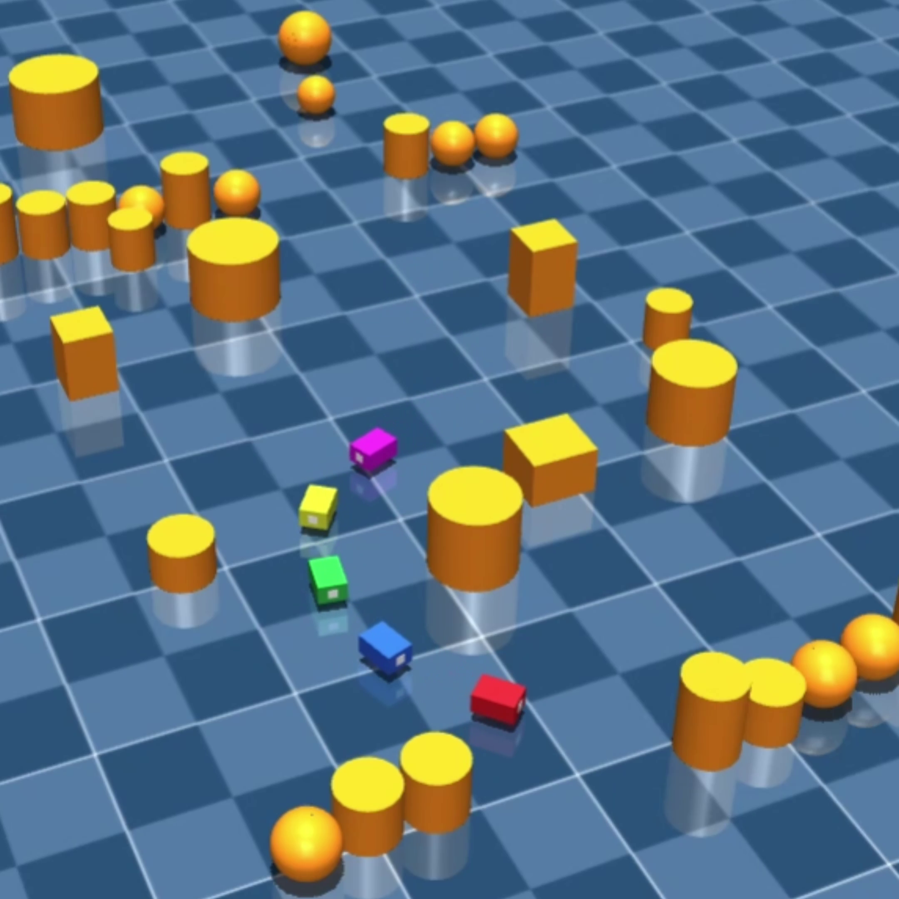

<h1 align="center">Hi there 👋</h1>
<h3 align="center">Robotics PhD Student · Aspiring Research Scientist</h3>

  
  
  

---

### 🦾 About Me

I'm a Robotics PhD student with a background in Mechanical Engineering, working toward a career as a research scientist. My work sits at the intersection of **control theory**, **dynamical systems**, and **AI-driven approaches** to robotics — combining classical engineering foundations with modern machine learning methods.

I completed my Master's degree in Robotics and Artificial Intelligence and am currently starting my PhD.

---

### 🔬 Research Interests

- Adaptive & robust control for robotic systems
- Dynamics and state estimation
- Reinforcement learning and AI methods for control
- Human-robot interaction
- Simulation-to-real transfer

---

### 🛠️ Tools & Technologies

  
  
  
  
  
  

---

### 📌 Featured Projects

| Project | Description |
|---|---|
| [Robot Swarm Leader Follower](#) | Simulating a Robot Swarm From Scratch — Leader-Follower Formation, Obstacle Avoidance in MuJoCo |
| [Demo title](#) | One-line description of the simulation / what it demonstrates |
| [Demo title](#) | One-line description of the simulation / what it demonstrates |

---

### 🎥 Demos & Simulations

Video demos of control algorithms, robotic simulations, and AI experiments — posted on my [YouTube channel](https://www.youtube.com/@Mir-robotics).

  

  <a href="https://www.youtube.com/watch?v=VIDEO_ID_1](https://youtube.com/shorts/gyOKlvq-LHQ?si=AxLz_KaIVgFBFR-y">
    <results/vlcsnap-2026-07-30-08h17m20s508.png />
  </a>
      
  <a href="https://www.youtube.com/watch?v=VIDEO_ID_1](https://youtube.com/shorts/gyOKlvq-LHQ?si=AxLz_KaIVgFBFR-y">
    <results/vlcsnap-2026-07-30-08h17m20s508.png />
  </a>

<!-- Replace VIDEO_ID_1 / VIDEO_ID_2 / VIDEO_ID_3 with your actual YouTube video IDs (the part after "v=" in the video URL), and update the links/descriptions in the table. -->

---

### 📄 Publications

- *Coming soon — will be updated as papers are published.*

---

### 📊 GitHub Stats

  
  

---

### 🔗 Connect With Me

  
  
  
  

